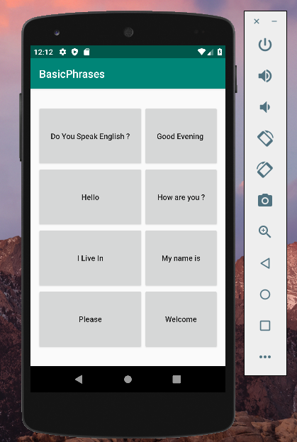

# BasicPhrase

### A simple app which coverts English alphabets to French. The purpose of this app is to learn about Media Player, Grid Layour, and tags in Android Studio. 

### In order to interact with the app just click the Button and you will hear the french audio for that English Word. 

